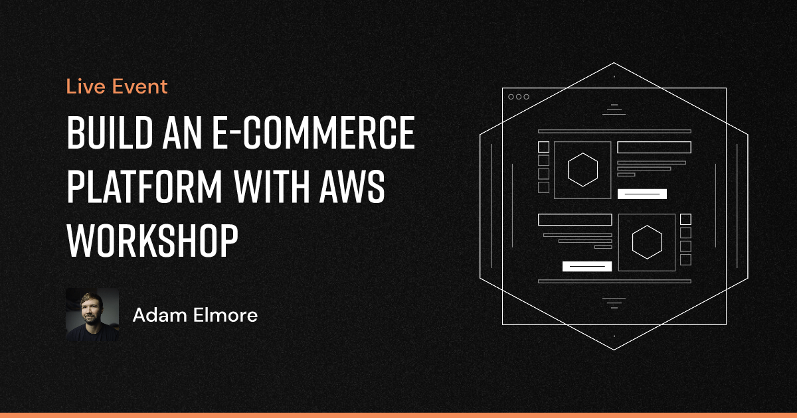

<a href="https://www.proaws.dev/events/build-an-e-commerce-platform-with-aws-workshop-ki3t9"></a>

## Prerequisites

- Some [experience with TypeScript](https://www.totaltypescript.com/tutorials)
- Some [experience with Node.js](https://nodejs.dev/en/learn)

## System Requirements

- [git][git] v2.18 or greater
- [NodeJS][node] v20 or greater
- [pnpm][pnpm] v8 or greater
- [sst][sst] ion (0.399 or greater)

All of these must be available in your `PATH`. To verify things are set up
properly, you can run this:

```shell
git --version
node --version
pnpm --version
sst version
```

If you have trouble with any of these, learn more about the PATH environment
variable and how to fix it here for [windows][win-path] or [mac/linux][mac-path].
If you're using Linux and don't know how to modify your PATH, WHO ARE YOU?! TELL ME MORE!


<!-- prettier-ignore-start -->
[pnpm]: https://pnpm.io/
[sst]: https://ion.sst.dev/
[node]: https://nodejs.org
[git]: https://git-scm.com/
[win-path]: https://www.howtogeek.com/118594/how-to-edit-your-system-path-for-easy-command-line-access/
[mac-path]: http://stackoverflow.com/a/24322978/971592
<!-- prettier-ignore-end -->

